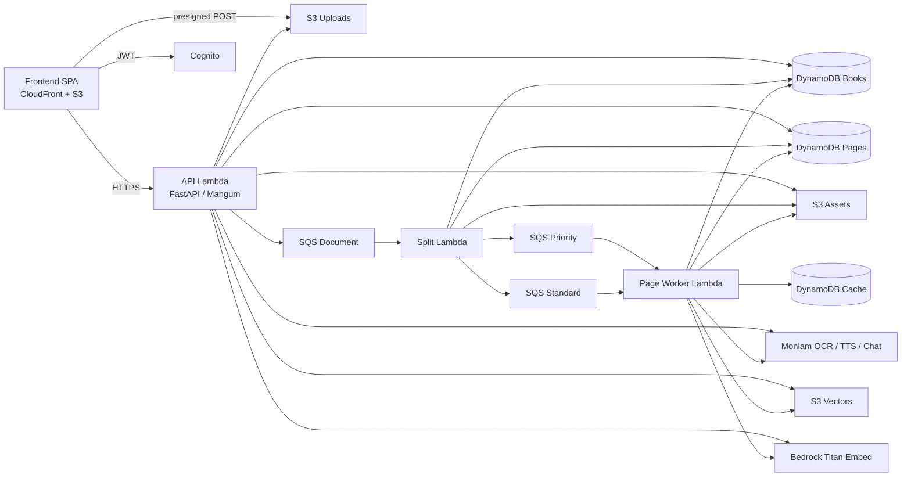
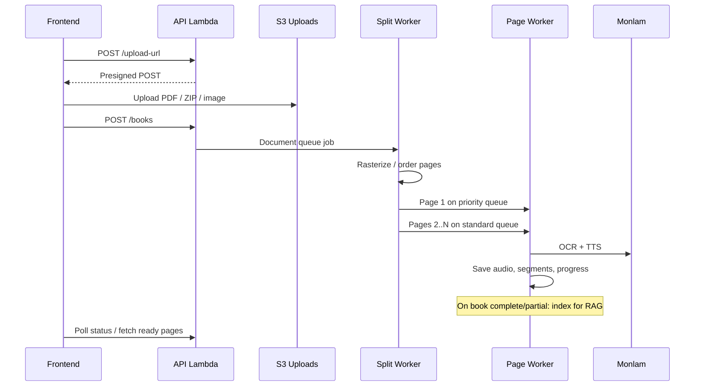
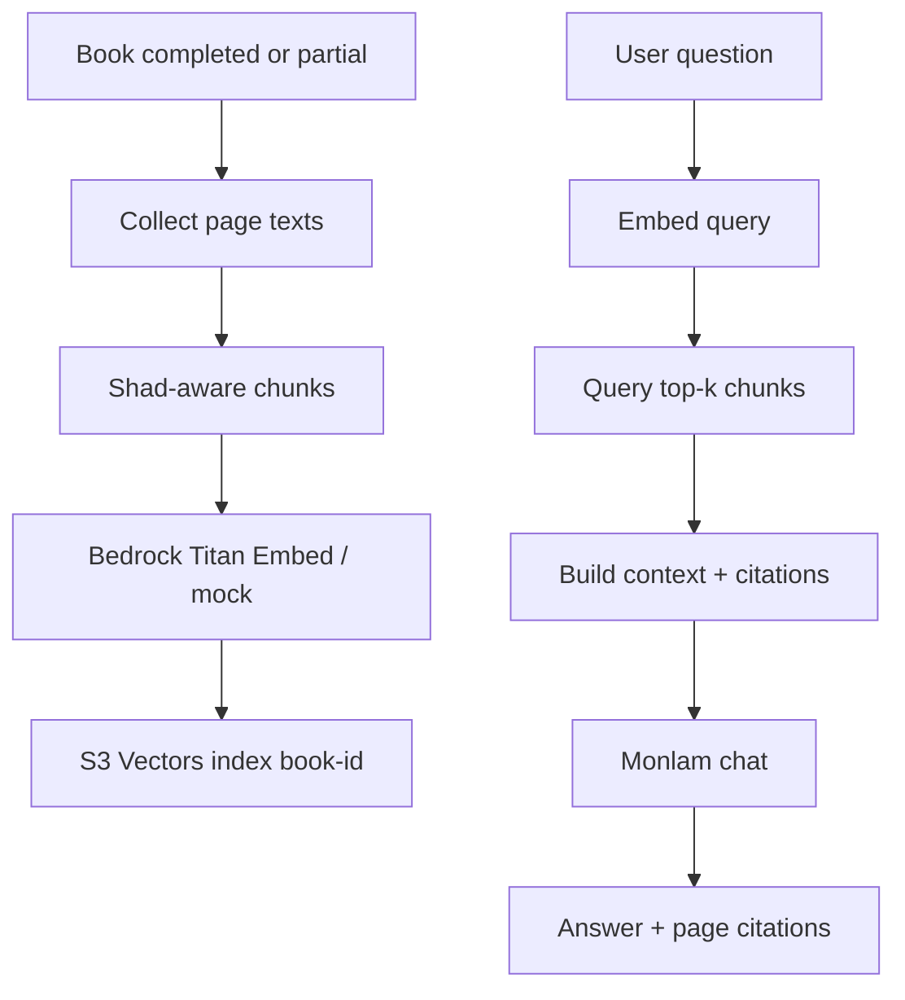

# dadhep

**dadhep** turns Tibetan PDFs and scanned page images into progressively available, page-aware audiobooks. Pages are processed one at a time so listening can start as soon as page 1 is ready. After a book finishes (or partially finishes), readers can ask questions grounded in that book’s text via RAG chat.

## High-level overview

| Area | What it does |
|------|----------------|
| **Upload** | Authenticated users upload a PDF, a single image, or several images (zipped in the browser). |
| **Split** | A worker rasterizes the PDF (or orders images), writes one page record per page, and queues OCR/TTS jobs. |
| **Listen** | The client polls status and plays sentence-level audio as pages become ready. |
| **Correct** | Users can fix OCR text; only that page’s audio is regenerated. |
| **Ask** | Per-book RAG over indexed page text (S3 Vectors + Bedrock embeddings + Monlam chat). |

### Primary use cases

1. **Create an audiobook from a PDF or scans** — Upload → process → open the reader when the first page is ready.
2. **Listen with sentence sync** — Highlight and seek by sentence; adjust speed, font size, and sleep timer.
3. **Fix bad OCR** — Double-click a sentence, submit a correction, keep listening to old audio until the new version arrives.
4. **Ask about a book** — On the details page, chat with answers grounded in retrieved passages and page citations.
5. **Manage a personal library** — Browse covers, track processing progress, delete books, save local bookmarks.
6. **Configure preferences** — Language (EN/BO), TTS voice dialect, and default playback speed.

### Product boundaries (MVP)

- Polling for progress (no WebSockets).
- Sentence / shad-level sync (not word-level unless the TTS provider supplies timings).
- Shared / published library is disabled until copyright and moderation are ready.
- Upload and page limits are Lambda-sized (defaults: 50 MB upload, 500 pages).

## Architecture



### Processing pipeline



### RAG chat (per book)



## Repository layout

| Path | Role |
|------|------|
| [`frontend/`](frontend/) | React + Vite + TypeScript SPA (library, upload, details, reader, chat) |
| [`backend/`](backend/) | FastAPI API, split worker, page worker, RAG |
| [`infra/`](infra/) | AWS CDK v2 stack (Cognito, S3, DynamoDB, SQS, Lambdas, CloudFront, S3 Vectors) |

Each package has its own README with low-level setup and commands.

## Tech stack (summary)

- **Frontend:** React 19, Vite, TypeScript, Tailwind 4, React Router, Cognito JS SDK  
- **Backend:** Python 3.12, FastAPI, Mangum, boto3, PyMuPDF, Pillow, httpx  
- **Auth:** Amazon Cognito (email/phone); local auth bypass for development  
- **AI providers:** Monlam REST (OCR, TTS, chat) or deterministic mock  
- **Embeddings / vectors:** Amazon Bedrock Titan Embed Text v2 + AWS S3 Vectors  
- **Infra:** AWS CDK (Python), CloudFront SPA hosting, GitHub Actions deploy via OIDC  

## Local prerequisites

- Node.js 20+
- Python 3.12
- AWS CLI + CDK CLI for deployed-mode work

```bash
# Backend
cd backend
python -m venv .venv
# Windows: .\.venv\Scripts\Activate.ps1
source .venv/bin/activate
pip install -r requirements-dev.txt
pytest

# Frontend
cd ../frontend
npm install
npm run test
npm run build

# Infra
cd ../infra
python -m venv .venv
source .venv/bin/activate
pip install -r requirements.txt
pytest
cdk synth
```

For a UI-only sandbox without AWS, see [frontend/README.md](frontend/README.md) (`VITE_AUTH_MODE=mock` and `VITE_USE_MOCK_API=true`).

## Deploy to AWS

1. Configure credentials and region (`aws configure`, `AWS_REGION`).
2. Ensure Secrets Manager secret `dadhep/monlam-api-key` exists (JSON field `key`). CDK references it; it does not create it.
3. Build the frontend (`cd frontend && npm ci && npm run build`) so `frontend/dist` exists for the CDK asset.
4. From `infra/`: create a venv, `pip install -r requirements.txt`, bootstrap once, then `cdk deploy`.
5. Use stack outputs (`ApiUrl`, `CloudFrontUrl`, Cognito IDs, `VectorBucketName`, …). Deploy writes runtime `config.js` for the SPA.

Details: [infra/README.md](infra/README.md). CI builds the frontend and can deploy on push when `AWS_DEPLOY_ROLE_ARN` is set.

## Further reading

- [Frontend](frontend/README.md) — routes, UI, mock mode, API client  
- [Backend](backend/README.md) — handlers, API, workers, RAG, env  
- [Infrastructure](infra/README.md) — CDK resources, sizing, outputs  
