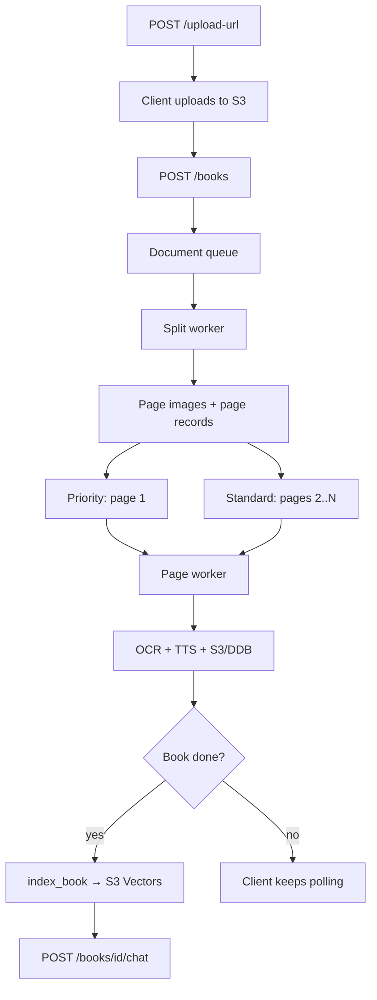

# dadhep backend

FastAPI service and AWS Lambda workers for Tibetan audiobook creation, progressive page processing, OCR correction, and per-book RAG chat.

## High-level components

| Entry | Role |
|-------|------|
| `app.handler.handler` | API Gateway / Lambda entry (Mangum wraps FastAPI) |
| `app.main:app` | Same FastAPI app for local `uvicorn` |
| `app.split_worker.handler` | SQS document splitter (PDF, image, or ZIP of images) |
| `app.page_worker.handler` | SQS OCR → segment → TTS; updates progress; triggers RAG index |
| `app.rag` | Chunk, embed, index, and query book text (S3 Vectors + Bedrock) |
| `app.providers` | `mock` (deterministic) or `rest` (Monlam OCR / TTS / chat) |

### Data stores (low level)

| Store | Keys / notes |
|-------|----------------|
| **Books** | PK `book_id`. GSIs for owner+created_at and status+updated_at (provisioned in CDK). |
| **Pages** | PK `book_id`, SK `page_number`. Status, OCR/corrected text, audio keys, segments, duration. |
| **Cache** | PK `cache_key`, TTL for provider/artifact caching. |
| **S3 Uploads** | Source PDFs / ZIPs / images via presigned POST. |
| **S3 Assets** | Page PNGs, cover, versioned TTS MP3s, segment metadata, `fulltext.txt`. |
| **S3 Vectors** | Bucket from CDK; per-book index name `book-{book_id}`. |

### Queues

| Queue | Consumer | Typical messages |
|-------|----------|------------------|
| Document | Split worker | New book split jobs |
| Priority page | Page worker | Page 1 and correction regenerations |
| Standard page | Page worker | Pages 2…N |

Each queue has an encrypted DLQ. Event sources should use `ReportBatchItemFailures` and a visibility timeout longer than the Lambda timeout.

## Use cases (backend)

1. **Accept upload + create book** — Presign S3 POST, create book row, enqueue split.
2. **Split document** — Rasterize PDF or unpack ordered images; create page rows; enqueue page jobs.
3. **Process a page** — OCR (Monlam or mock), local cleanup/segmentation (shad-aware), TTS per sentence + page audio, write S3 + DynamoDB, advance book progress.
4. **Regenerate after correction** — Priority job with `text_override`; keep prior `audio_key` until the new version completes; re-index RAG when done.
5. **Index & chat** — On book `completed` / `partial` (or lazily on first chat), index chunks; answer questions with retrieved context and page citations.
6. **Delete book** — Remove pages, S3 objects under the book prefix, and the vector index.

## Processing workflow



Workers use conditional version/status updates, versioned S3 keys, partial batch failures, and terminal attempt counters for safe retries.

## HTTP API

| Method | Path | Notes |
|--------|------|--------|
| `GET` | `/health` | Public liveness |
| `GET` | `/docs`, `/redoc`, `/openapi.json` | OpenAPI (public at API GW) |
| `POST` | `/upload-url` | Presigned S3 POST fields; size limit enforced |
| `POST` | `/books` | `202` — creates book, queues split |
| `GET` | `/books` | Owner’s books (+ cover URLs) |
| `GET` | `/books/{book_id}` | Book metadata |
| `GET` | `/books/{book_id}/status` | Progress, page summaries, `ready_pages` |
| `GET` | `/books/{book_id}/pages/{n}` | Page payload + short-lived media URLs |
| `PATCH` | `/books/{book_id}/pages/{n}` | `{ "text"?, "regenerate": true }` → correcting |
| `POST` | `/books/{book_id}/chat` | `{ "message", "history" }` → answer + `citations` |
| `DELETE` | `/books/{book_id}` | Hard delete; `204` |

**Book status:** `uploading` → `queued` → `splitting` → `processing` → `completed` | `partial` | `failed`  
**Page status:** `queued` | `processing` | `completed` | `correcting` | `failed`  
**Index status:** `pending` | `indexing` | `ready` | `failed`

Auth: Cognito JWT bearer in deployed environments. Locally, `LOCAL_AUTH_BYPASS=true` (refused when `ENV` is `staging` or `production`). Multi-user local: `Authorization: Bearer local-alice` (or `LOCAL_USER_ID`).

## RAG (low level)

Module: `app/rag.py`.

1. Collect text from completed pages (DynamoDB and/or S3 `fulltext.txt` per page).
2. Write consolidated `books/{id}/fulltext.txt` under the assets bucket.
3. Chunk on Tibetan shad / punctuation (~1200 chars, ~200 overlap by default).
4. Embed with Bedrock Titan Embed Text v2 (`1024` dims) in production; deterministic mock vectors when `ENV` is `local`/`test` or `MONLAM_PROVIDER=mock`.
5. Create/replace S3 Vectors index `book-{book_id}` (cosine, float32); store non-filterable `text` metadata plus page/chunk ids.
6. Chat: embed question → `query_vectors` top-k → budgeted context → Monlam `chat` (e.g. model `melong`) → return answer + page citations.

The **vector bucket** is created by CDK. The app creates **per-book indexes** at index time (not the bucket).

## Providers

| `MONLAM_PROVIDER` | Behavior |
|-------------------|----------|
| `mock` (default for tests/local) | Deterministic OCR stub, fake MP3 TTS, mock chat |
| `rest` | HTTP client to Monlam API (`MONLAM_API_URL`, secret key, configurable OCR/TTS/chat paths) |

OCR multipart field name and TTS path are configured via settings (`monlam_ocr_path`, `monlam_tts_path`, etc.). Cleanup is local (no Monlam cleanup endpoint).

## Local development

Requires Python 3.12.

```bash
python -m venv .venv
# Windows: .\.venv\Scripts\Activate.ps1
source .venv/bin/activate
pip install -r requirements-dev.txt
cp .env.example .env   # or copy on Windows
uvicorn app.main:app --host 127.0.0.1 --port 8001 --reload
pytest
```

Important settings (see `app/config.py` and `.env.example`):

- `ENV`, `SERVICE` (`api` | `split` | `page`)
- Table names, bucket names, queue URLs
- `LOCAL_AUTH_BYPASS`, Cognito pool/client (when not bypassing)
- `MONLAM_PROVIDER`, `MONLAM_API_URL`, `MONLAM_API_KEY` / secret
- `VECTOR_BUCKET`, `EMBEDDING_MODEL_ID`, RAG/chunk tunables
- Optional `AWS_ENDPOINT_URL` for LocalStack (S3/DDB/SQS); S3 Vectors and Bedrock still use real AWS clients when configured

Deploy with the sibling [`../infra`](../infra) CDK app. Do not treat any SAM `template.example.yaml` as the full production stack.
