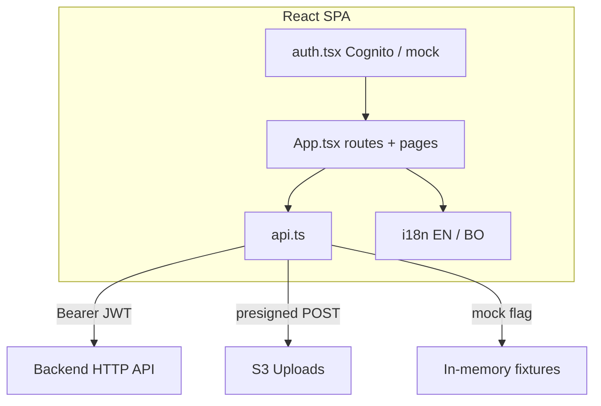

# dadhep frontend

Mobile-first React + Vite client for uploading Tibetan documents, listening to sentence-synchronized audiobooks, managing a personal library, and chatting with a book via RAG.

## High-level features

| Feature | Description |
|---------|-------------|
| **Library** | Cover grid for personal uploads; processing badge + percent; shared tab is a placeholder |
| **Upload** | PDF, one image, or many images (ordered ZIP via `fflate`); title; voice from settings |
| **Processing** | Poll job/book status; open the book when the first page is ready |
| **Details** | Cover, metadata, about excerpt, narration/language/duration/added tiles, page list, delete |
| **Chat** | Desktop sticky sidebar; mobile FAB + bottom sheet; suggested prompts; page citations |
| **Reader** | Sentence highlight synced to audio; speed, sleep timer, font size, seek, bookmarks |
| **Correction** | Double-click a sentence → modal → regenerate that page’s audio |
| **Settings** | Account, EN/BO UI language, TTS voices, default speed |
| **Bookmarks** | Saved places in `localStorage` (`dadhep.bookmarks`) |

### Use cases (UI)

1. Sign in (Cognito) or use local mock auth.  
2. Upload a PDF or page images and watch library progress.  
3. Open a book → Start listening, or jump to a page from the TOC.  
4. Follow the highlighted sentence; change speed / font; bookmark a place.  
5. Correct OCR when a sentence is wrong; keep listening until regen finishes.  
6. Ask “What is the main teaching?” (and similar) in the book chat panel.  
7. Delete a book from the details page after confirmation.

## Routes

| Path | Screen |
|------|--------|
| `/login` | Sign-in / register / verify |
| `/`, `/library` | Library tabs (uploads / shared) |
| `/upload` | Upload wizard |
| `/jobs/:id` | Processing progress |
| `/books/:id` | Book details + chat (when ready) |
| `/books/:id/read` | Reader + bottom player card |
| `/bookmarks` | Local bookmarks list |
| `/settings` | Preferences |

Runtime config: Vite `VITE_*` env vars locally, or deployed `public/config.js` / `window.APP_CONFIG` (Cognito IDs + `ApiUrl`) after CDK deploy.

## Architecture (client)



Main UI lives in `src/App.tsx` (library, upload, details, `BookChatPanel`, reader, bookmarks, settings). Shared pieces: `api.ts`, `auth.tsx`, `config.ts`, `i18n.tsx`, `types.ts`, `index.css`.

## Local development

```sh
npm install
cp .env.example .env.local   # or copy on Windows
npm run dev
```

### Fixture mode (no AWS)

Set **both**:

```env
VITE_AUTH_MODE=mock
VITE_USE_MOCK_API=true
```

### Cognito + real API

```env
VITE_AUTH_MODE=cognito
VITE_USE_MOCK_API=false
VITE_COGNITO_USER_POOL_ID=...
VITE_COGNITO_CLIENT_ID=...
VITE_API_URL=https://....execute-api....amazonaws.com
```

## Commands

| Command | Purpose |
|---------|---------|
| `npm run dev` | Vite dev server |
| `npm test` | Vitest + Testing Library |
| `npm run build` | `tsc` + production build (required before CDK deploy) |
| `npm run lint` | Oxlint |

## API client (`src/api.ts`)

Authenticated calls attach the Cognito (or mock) bearer token.

| Client usage | Backend |
|--------------|---------|
| Upload URL + form POST | `POST /upload-url` → S3 |
| Create / list / get book | `POST/GET /books`, `GET /books/:id` |
| Progress | `GET /books/:id/status` |
| Page media | `GET /books/:id/pages/:page` |
| Correction | `PATCH /books/:id/pages/:page` |
| Chat | `POST /books/:id/chat` |
| Delete | `DELETE /books/:id` |

Multiple images are packed into an ordered ZIP in the browser before upload. The processing screen polls status and navigates when the first page is ready.

## UI notes

- Site background: `src/assets/background.svg` (full-bleed `cover`).
- Details page: two-column layout with sticky chat on desktop; FAB + sheet on small screens.
- Reader: shared top bar; floating player card (page nav, zoom, bookmark, transport); active sentence auto-scrolls into view.
- Library cards: square brown cover with inset frame, `object-fit: contain`, processing badge `status · N%` with pulse animation.
