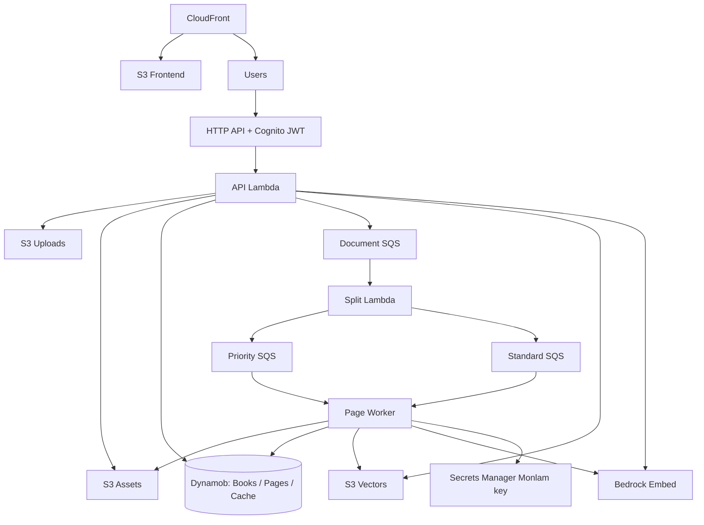

# dadhep AWS infrastructure

AWS CDK v2 (Python) provisions the MVP as one stack (`Dadhep`): auth, storage, queues, three Lambdas, HTTP API, CloudFront SPA hosting, and an S3 Vectors bucket for RAG.

## High-level inventory

| Area | Resources |
|------|-----------|
| **Identity** | Cognito user pool (email/phone aliases, self sign-up); app client; HTTP API JWT authorizer |
| **Object storage** | Private encrypted versioned S3: uploads, generated assets, frontend |
| **Vectors** | `AWS::S3Vectors::VectorBucket` (AES256, `RemovalPolicy.RETAIN`) for per-book RAG indexes |
| **CDN** | CloudFront + OAC, HTTPS, SPA rewrite; audio stays private via short-lived API-issued URLs |
| **Data** | DynamoDB Books (GSIs: owner+created_at, status+updated_at), Pages (PK book_id / SK page_number), Cache (TTL) |
| **Queues** | Document, priority-page, standard-page SQS + DLQs |
| **Compute** | API Lambda, split Lambda, page-worker Lambda (priority + standard event sources) |
| **Secrets** | Reference to existing `dadhep/monlam-api-key` (CDK does **not** create it) |
| **Ops** | Least-privilege IAM, X-Ray, ~1 month log retention, DLQ/Lambda/API alarms |



## Use cases (infra)

1. **Host the SPA** — Build `frontend/dist`, deploy static assets + inject `config.js` (API URL, Cognito IDs).  
2. **Secure the API** — Cognito JWT on protected routes; public `/health` and OpenAPI docs as configured.  
3. **Run the pipeline** — Wire document → split → priority/standard page queues to the right Lambdas.  
4. **Enable RAG** — Create the vector bucket; grant API/worker `s3vectors:*` index/vector APIs + `bedrock:InvokeModel` for Titan Embed.  
5. **Operate safely** — DLQs, reserved concurrency caps, alarms; retain Cognito and the vector bucket on stack delete by default.

## Source layout

Deployable assets come from sibling packages:

| Input | Path |
|-------|------|
| Lambda code | `../backend` (bundled with manylinux Python 3.12 wheels; Docker only as CDK fallback) |
| Frontend | `../frontend/dist` |

Default handlers: `app.handler.handler`, `app.split_worker.handler`, `app.page_worker.handler`  
Overrides: CDK context `apiHandler`, `splitHandler`, `pageWorkerHandler`.

Both backend sources and a built frontend must exist before `cdk synth` / `deploy` (tests may inject temp assets).

## Setup

From `infra/`:

```powershell
python -m venv .venv
.\.venv\Scripts\Activate.ps1
python -m pip install -r requirements.txt
pytest
npx aws-cdk synth
```

Bootstrap once, then deploy:

```powershell
npx aws-cdk bootstrap aws://ACCOUNT/REGION
# Ensure frontend is built first:
#   cd ..\frontend; npm ci; npm run build
npx aws-cdk deploy
```

The Monlam secret must already exist in the region. Override the name with `-c monlamSecretName=path/to/secret`. Default context also sets `monlamProvider=rest` and `monlamApiUrl`.

## Runtime sizing (`cdk.json` defaults)

| Function | Memory | Timeout | Ephemeral | Reserved concurrency |
|----------|--------|---------|-----------|----------------------|
| API | 1024 MiB | **90 s** | 512 MiB | 200 |
| Split | 2048 MiB | 300 s | 2048 MiB | 2 |
| Page worker | 3008 MiB | 300 s | 4096 MiB | 50 |

SQS event sources (defaults): document batch size `1` / max concurrency `2`; page priority max concurrency `10`, standard `40` (batch size `1` each). Priority + standard must fit under the worker’s reserved concurrency.

Override any value with `-c key=value`. Synthesis validates memory/ephemeral ranges and concurrency relationships.

Other useful context: `embeddingModelId` (default `amazon.titan-embed-text-v2:0`), `stageName`.

## Environment injected into Lambdas

Shared (typical): `ENV`, table names, upload/assets bucket names, `VECTOR_BUCKET`, `EMBEDDING_MODEL_ID`, dimensions.

| Lambda | Extra |
|--------|--------|
| API | `SPLIT_QUEUE_URL`, Monlam env/secret, Cognito-related settings as used by the app |
| Split | `PRIORITY_QUEUE_URL`, `PAGE_QUEUE_URL` (standard) |
| Page worker | Monlam env/secret, `PROCESSING_LEASE_SECONDS` |

API and page-worker roles include Bedrock invoke + S3 Vectors index/vector actions (bucket create is stack-owned).

## Stack outputs

Among others: `ApiUrl`, `CloudFrontUrl`, `CloudFrontDistributionId`, `UserPoolId`, `UserPoolClientId`, upload/assets/frontend bucket names, `VectorBucketName`, `VectorBucketArn`, table names, queue URLs.

## CORS and production hardening

The API currently allows broad browser origins because the frontend hostname is not known until after the first deploy. For production, restrict `allow_origins` to the CloudFront (or custom) origin.

## Removal policies (current stack)

| Resource | Policy |
|----------|--------|
| Books / Pages / Cache tables | `DESTROY` (MVP convenience) |
| Uploads / assets / frontend buckets | `DESTROY` |
| Cognito user pool | `RETAIN` |
| S3 Vectors bucket | `RETAIN` |

Treat production data carefully; change policies before real user data if you need retention.

## Notes

- Pages are accessed by `book_id` + `page_number` (no extra Pages GSIs in this stack).  
- Page priority queue defaults to `10` concurrent invocations and standard to `40` (50 total under the worker reserved concurrency). Raise priority further if you need faster page-1 / correction turnaround.  
- Requires `aws-cdk-lib` with S3 Vectors L1 support (see `requirements.txt`).  
